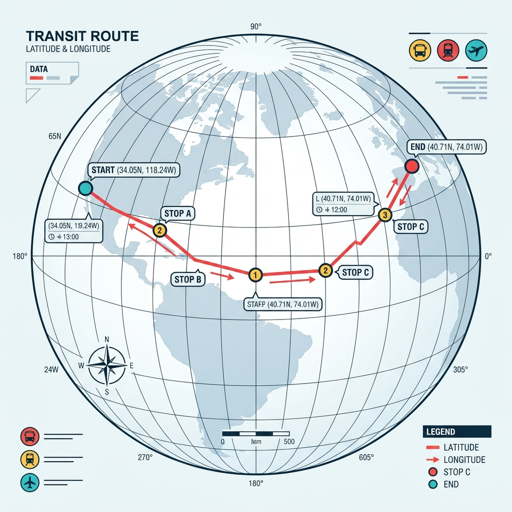
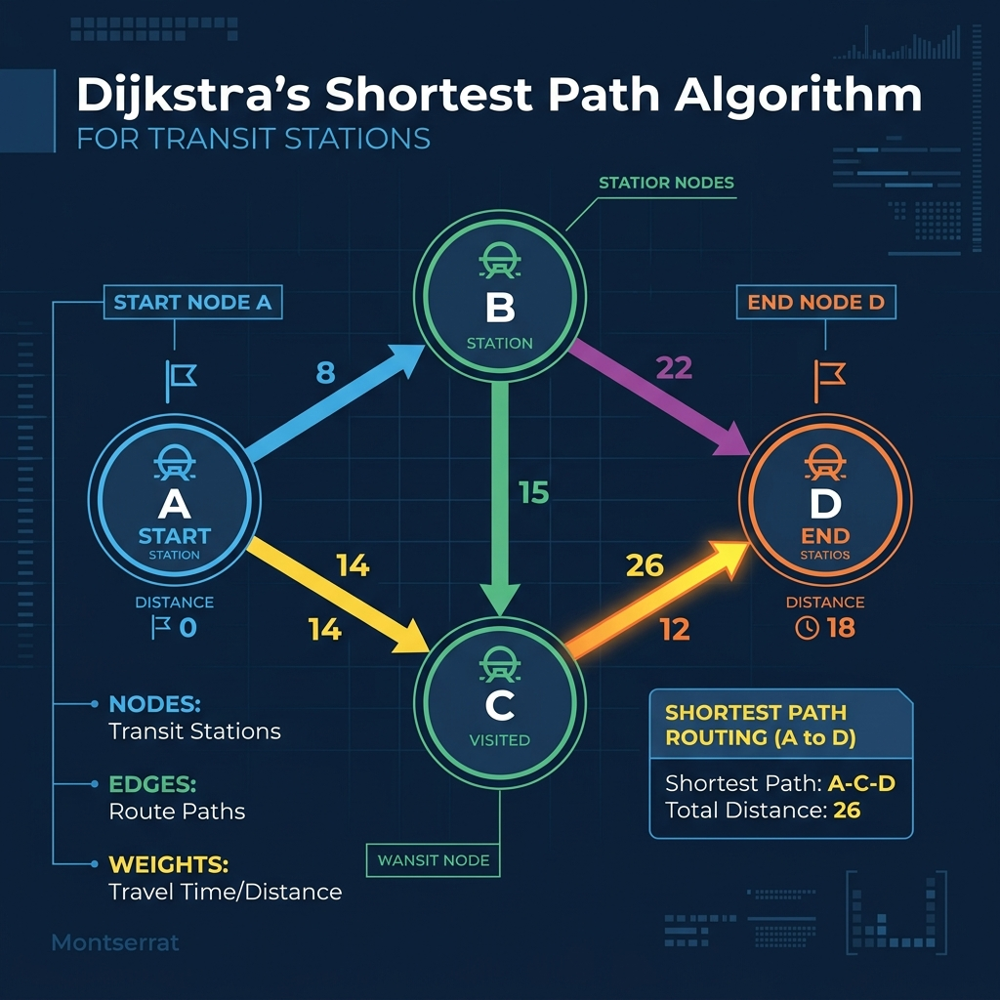

# Rancang Bangun Peta Transportasi Publik Interaktif
## Buku Ajar & Panduan Praktis Pengembangan Web GIS Menggunakan React, Leaflet, dan Supabase

Buku ini disusun sebagai jembatan antara teori Geografi (Sistem Informasi Geografis berbasis Web) dan implementasi Praktis Rekayasa Perangkat Lunak. Buku ini dirancang untuk mahasiswa S1 Geografi, Sistem Informasi, Teknik Informatika, maupun developer mandiri yang ingin merancang platform informasi rute secara terstruktur.

---

## KATA PENGANTAR

Peta digital bukan lagi sekadar penunjuk arah pasif, melainkan instrumen dinamis yang memandu mobilitas harian jutaan orang. Digitalisasi informasi rute angkutan umum massal adalah langkah krusial agar masyarakat dapat beralih ke transportasi umum dengan nyaman. Buku ini hadir untuk membekali Anda dengan pengetahuan merancang sistem peta transportasi terintegrasi dari nol hingga siap pakai.

---

## CATATAN UNTUK PEMBACA: ORIGIN STORY & VISI

### Awal Mula Sebuah Ide
Proyek **Metro Jabar Trans (MJT)** lahir dari sebuah Tugas Besar perkuliahan Teknologi Pemrograman Web (TPBW). Awalnya, proyek ini hanya dimaksudkan untuk memenuhi syarat kelulusan mata kuliah dengan memetakan beberapa rute bus lokal secara statis. Namun, seiring berjalannya proses pengembangan, kami menyadari sebuah realita penting: **Indonesia sedang mengalami kebangkitan transportasi umum massal.**

Di berbagai penjuru Nusantara, sistem transportasi modern bermunculan—mulai dari sistem BRT legendaris *TransJakarta*, *Trans Metro Pasundan* di Bandung, *Trans Jateng*, hingga *Trans Musi* di Palembang dan layanan *Teman Bus* di berbagai wilayah regional lainnya. Sayangnya, data spasial rute dan halte ini sering kali terserak, tidak terdokumentasi dengan baik dalam format terbuka (Open Data), atau sulit diakses secara interaktif oleh publik maupun akademisi yang ingin melakukan analisis aksesibilitas.

### Misi Buku ini
Buku ini ditulis untuk membantu Anda—khususnya rekan-rekan dari program studi **S1 Geografi, Sistem Informasi, dan Informatika**—yang ingin membangun sistem informasi pemetaan serupa secara mandiri. Kami meramu buku ini agar memiliki pendekatan hibrida:
1. **Buku Populer**: Alur penjelasan yang mengalir dan mudah dipahami dengan analogi sehari-hari.
2. **Buku Tutorial**: Menyajikan contoh implementasi kode program yang dapat langsung diuji coba.
3. **Buku Ajar**: Menyertakan pemodelan spasial teoretis, relasi database, dan visualisasi kartografi digital yang dapat dijadikan referensi pengajaran di kelas.

---

## BAB 1: LANSKAP TRANSPORTASI PUBLIK MASSAL DI INDONESIA

### 1.1 Era Kebangkitan Transit Perkotaan
Digitalisasi informasi transit adalah kunci keberhasilan integrasi transportasi perkotaan. Berikut perbandingan sistem transportasi massal jalan raya di beberapa kota besar Indonesia:

```
                  ┌───────────────────────────────┐
                  │    Transportasi Massal Ind.   │
                  └───────────────┬───────────────┘
                                  │
         ┌────────────────────────┼────────────────────────┐
         ▼                        ▼                        ▼
   TransJakarta             Teman Bus Bandung         Trans Musi Palembang
   (BRT Lajur Khusus,       (Konektivitas Angkutan   (Feeder Transit dan
    Terpanjang di Dunia)     Feeder Koridor Wilayah)   Integrasi LRT Sumsel)
```

Setiap daerah memiliki karakteristik data tersendiri. Namun, semuanya memiliki elemen spasial dasar yang serupa: **Jalur perjalanan (Line/Polyline)** dan **Titik Pemberhentian/Halte (Point/Marker)**.

### 1.2 Tantangan Aksesibilitas Informasi Spasial
Masalah utama yang dihadapi calon penumpang adalah ketidakpastian informasi:
* *Di mana koordinat halte terdekat dari posisi saya saat ini?*
* *Bagaimana rute terpendek menuju tujuan jika harus berpindah (transit) koridor?*
* *Di mana posisi bus saat ini dan berapa estimasi waktu kedatangannya (ETA)?*

Aplikasi **Metro Jabar Trans (MJT)** dirancang untuk menjawab tantangan tersebut dengan menggabungkan peta interaktif frontend dan basis data relasional.

---

## BAB 2: DASAR-DASAR PEMETAAN WEB & DATABASE RELASIONAL

### 2.1 Apa itu Web GIS?
Web GIS adalah sistem informasi geografis yang dapat diakses melalui web browser. Peta disajikan dalam susunan ubin citra (Raster/Vector Tiles) yang dimuat secara dinamis berdasarkan tingkat pembesaran (Zoom Level).

### 2.2 Tipe Data Spasial pada Web
Pada platform Web GIS, koordinat dinyatakan dalam format lintang dan bujur desimal menggunakan datum **WGS84**.
* **Titik (Point)**: Halte, wisata, kuliner. Contoh: `[-6.9024, 107.6187]` (Gedung Sate).
* **Garis (Polyline)**: Jalur koridor bus, yang dibentuk oleh array koordinat titik secara berurutan.

### 2.3 Persiapan Infrastruktur Supabase
Untuk menyimpan data spasial dan informasi pendukung, kita menggunakan **Supabase**, sebuah platform Backend-as-a-Service (BaaS) berbasis PostgreSQL yang mendukung penyimpanan objek terstruktur.

#### Skema Tabel SQL (`migration.sql`):
```sql
-- Tabel Wisata Sekitar Rute
CREATE TABLE tourism_spots (
  id TEXT PRIMARY KEY,
  nama TEXT NOT NULL,
  deskripsi TEXT,
  harga TEXT,
  halte_terdekat TEXT,
  koridor TEXT[],
  gambar TEXT[],
  lat DOUBLE PRECISION,
  lng DOUBLE PRECISION
);

-- Tabel Kuliner Sekitar Rute
CREATE TABLE culinary_spots (
  id TEXT PRIMARY KEY,
  nama TEXT NOT NULL,
  deskripsi TEXT,
  harga TEXT,
  halte_terdekat TEXT,
  koridor TEXT[],
  gambar TEXT[],
  lat DOUBLE PRECISION,
  lng DOUBLE PRECISION
);

-- Tabel Koridor & Halte
CREATE TABLE corridors (
  id TEXT PRIMARY KEY,
  name TEXT NOT NULL,
  route TEXT NOT NULL,
  color TEXT NOT NULL,
  operating_hours TEXT,
  total_stop_points INT,
  path JSONB NOT NULL,    -- Array koordinat [[lat, lng], [lat, lng], ...]
  stops JSONB NOT NULL   -- Detail halte [{name: "Halte A", lat: -6.9, lng: 107.6}, ...]
);
```

#### Client SDK Supabase (`src/utils/supabaseClient.js`):
```javascript
import { createClient } from '@supabase/supabase-js';

const supabaseUrl = import.meta.env.VITE_SUPABASE_URL;
const supabaseAnonKey = import.meta.env.VITE_SUPABASE_ANON_KEY;

export const supabase = createClient(supabaseUrl, supabaseAnonKey);
```

---

## BAB 3: FONDASI PETASAN (REACT, LEAFLET & OPENSTREETMAP)

### 3.1 Menginisialisasi Peta Pertama
Untuk menampilkan peta di dalam React, kita menggunakan pustaka `react-leaflet` yang membungkus pustaka Leaflet.js.

```jsx
import { MapContainer, TileLayer, ZoomControl } from "react-leaflet";
import "leaflet/dist/leaflet.css";

const MAP_CENTER = [-6.9147, 107.6098]; // Pusat Peta (Kota Bandung)
const MAP_ZOOM = 13;

export default function BasicMap() {
  return (
    <MapContainer center={MAP_CENTER} zoom={MAP_ZOOM} style={{ height: "400px", width: "100%" }}>
      <TileLayer
        attribution='&copy; <a href="https://carto.com/">CARTO</a>'
        url="https://{s}.basemaps.cartocdn.com/light_all/{z}/{x}/{y}{r}.png"
      />
      <ZoomControl position="bottomleft" />
    </MapContainer>
  );
}
```

### 3.2 Penanganan Bug Ikon Marker Leaflet
Saat memuat Leaflet di dalam proyek React Modern (Vite/Webpack), ikon penanda sering kali pecah atau hilang karena masalah pemetaan path ikon default oleh bundler. Anda dapat menyelesaikannya dengan memasukkan kode inisialisasi berikut di awal aplikasi:

```javascript
import L from "leaflet";

delete L.Icon.Default.prototype._getIconUrl;
L.Icon.Default.mergeOptions({
  iconRetinaUrl: "https://cdnjs.cloudflare.com/ajax/libs/leaflet/1.9.4/images/marker-icon-2x.png",
  iconUrl: "https://cdnjs.cloudflare.com/ajax/libs/leaflet/1.9.4/images/marker-icon.png",
  shadowUrl: "https://cdnjs.cloudflare.com/ajax/libs/leaflet/1.9.4/images/marker-shadow.png",
});
```

### 3.3 Visualisasi Teori Titik & Garis
Bagaimana titik-titik koordinat spasial dihubungkan menjadi rute logis pada peta?



*Preview:* Ketika kode di atas dijalankan, peta dasar (CartoDB Light) akan memuat wilayah Bandung. Titik koordinat awal digambarkan sebagai marker, dan deretan koordinat selanjutnya digambar sebagai garis polyline yang saling terhubung membentuk jalur transit.

---

## BAB 4: USE CASE 1 - RENDERING JALUR KORIDOR DINAMIS

### 4.1 Pembuatan Komponen Jalur (`CorridorLayer.jsx`)
Untuk menggambar koridor transportasi, kita tidak boleh menarik garis lurus sederhana dari terminal asal ke terminal tujuan. Kita harus mengambil sekumpulan koordinat detail yang mengikuti kelokan jalan asli.

```jsx
import { Polyline } from "react-leaflet";

export default function SimpleCorridor({ corridor, visible }) {
  if (!visible || !corridor.path) return null;

  return (
    <Polyline
      positions={corridor.path}
      pathOptions={{
        color: corridor.color, // Mengikuti warna koridor yang dinamis
        weight: 5,
        opacity: 0.85,
        lineCap: "round",
        lineJoin: "round",
      }}
      smoothFactor={1}
    />
  );
}
```

### 4.2 Manajemen Warna Koridor
Menggunakan warna yang berbeda untuk setiap koridor sangat penting untuk menjaga kejelasan peta (kartografi visual). Misalnya:
* **Koridor 1**: Hijau Hutan (`#00A651`)
* **Koridor 2**: Biru Samudra (`#007b83`)
* **Koridor 3**: Jingga Cerah (`#F39C12`)

---

## BAB 5: USE CASE 2 - PENGELOLAAN HALTE & BOOKMARK OFFLINE

### 5.1 Kustomisasi Ikon Halte Berwarna Koridor
Menampilkan puluhan halte dengan pin standar bawaan browser akan membuat visual peta menjadi semrawut. Kita dapat mendesain ulang marker menggunakan `L.divIcon` untuk menampilkan representasi svg bus mini dengan warna sesuai koridornya.

```javascript
import L from "leaflet";

const createStopIcon = (color) => {
  return L.divIcon({
    className: "custom-mjt-bus-stop",
    html: `
      <div style="
        width: 24px; 
        height: 24px; 
        background-color: white; 
        border: 2px solid ${color || '#333'}; 
        border-radius: 50%; 
        display: flex; 
        align-items: center; 
        justify-content: center;
        box-shadow: 0 2px 4px rgba(0,0,0,0.3);
      ">
        <svg viewBox="0 0 24 24" width="14" height="14" fill="${color || '#333'}">
          <path d="M4 16c0 .88.39 1.67 1 2.22V20c0 .55.45 1 1 1h1c.55 0 1-.45 1-1v-1h8v1c0 .55.45 1 1 1h1c.55 0 1-.45 1-1v-1.78c.61-.55 1-1.34 1-2.22V6c0-3.5-3.58-4-8-4s-8 .5-8 4v10zm3.5 1c-.83 0-1.5-.67-1.5-1.5S6.67 14 7.5 14s1.5.67 1.5 1.5S8.33 17 7.5 17zm9 0c-.83 0-1.5-.67-1.5-1.5s.67-1.5 1.5-1.5 1.5.67 1.5 1.5-.67 1.5-1.5 1.5zm1.5-6H6V6h12v5z"/>
        </svg>
      </div>
    `,
    iconSize: [24, 24],
    iconAnchor: [12, 12],
  });
};
```

### 5.2 Fitur Bookmark Menggunakan Local Storage
Pengguna dapat menyimpan daftar halte favorit untuk memudahkan akses pencarian rute cepat tanpa perlu mencari manual di peta setiap kali membuka aplikasi.

```javascript
// State inisialisasi dari localStorage
const [savedStops, setSavedStops] = useState(() => {
  const saved = localStorage.getItem("mjt_saved_stops");
  return saved ? JSON.parse(saved) : [];
});

const handleSaveStop = (stop) => {
  const uniqueId = `${stop.name}-${stop.lat}-${stop.lng}`;
  const exists = savedStops.find(s => s.uniqueId === uniqueId);
  
  let updatedStops;
  if (exists) {
    // Hapus dari favorit jika sudah terdaftar (Toggle Off)
    updatedStops = savedStops.filter(s => s.uniqueId !== uniqueId);
  } else {
    // Tambah ke daftar favorit (Toggle On)
    updatedStops = [...savedStops, { ...stop, uniqueId, savedAt: new Date().toISOString() }];
  }
  setSavedStops(updatedStops);
  localStorage.setItem("mjt_saved_stops", JSON.stringify(updatedStops));
};
```

---

## BAB 6: USE CASE 3 - SIMULASI REAL-TIME & SISTEM REKOMENDASI DIJKSTRA

### 6.1 Simulator Posisi Pergerakan Bus (`MovingBus.jsx`)
Dalam dunia nyata, GPS tracker (IoT) terpasang pada bus untuk mengirim koordinat terbarunya secara periodik melalui protokol MQTT/HTTP. Sebagai sarana pembelajaran di kelas, kita dapat mensimulasikan pergerakan bus di web client dengan memindahkan marker penanda secara periodik mengikuti koordinat jalur (polyline) koridor.

```jsx
import { useEffect, useState } from "react";
import { Marker } from "react-leaflet";
import L from "leaflet";

export default function MovingBus({ path, color, busNumber }) {
  const [index, setIndex] = useState(0);

  useEffect(() => {
    if (!path || path.length === 0) return;
    const interval = setInterval(() => {
      // Loop kembali ke koordinat awal jika sudah mencapai ujung jalur
      setIndex((prev) => (prev + 1) % path.length);
    }, 2500); // Berpindah koordinat setiap 2.5 detik

    return () => clearInterval(interval);
  }, [path]);

  const currentPos = path[index] || path[0];
  const busIcon = L.divIcon({
    html: `<div style="background-color: ${color}; border: 2px solid white; border-radius: 4px; padding: 2px 6px; color: white; font-weight: bold; font-size: 10px; display: inline-block; white-space: nowrap; box-shadow: 0 2px 5px rgba(0,0,0,0.3);">🚌 ${busNumber}</div>`,
    iconSize: [60, 24],
    iconAnchor: [30, 12]
  });

  return <Marker position={currentPos} icon={busIcon} />;
}
```

### 6.2 Sistem Pencarian Rute Transit Terpendek (Algoritma Dijkstra)
Salah satu keunggulan dari aplikasi Metro Jabar Trans adalah kemampuan merekomendasikan rute perjalanan dari halte asal ke halte tujuan, termasuk petunjuk di mana penumpang harus melakukan transit antar-koridor.

#### Pemodelan Jaringan Graf
Jaringan halte dan rute dimodelkan sebagai graf berbobot:
1. **Halte berurutan** dalam satu koridor yang sama dihubungkan sebagai sisi berkendara (*ride edges*). Bobotnya adalah jarak geografis asli antara halte tersebut dalam kilometer (menggunakan rumus Haversine).
2. **Halte berbeda koridor** yang berada di lokasi berdekatan (radius $\le 400$ meter) dihubungkan sebagai sisi transit (*transfer edges*). Untuk mengoptimalkan kenyamanan pengguna, kita menambahkan bobot penalti sebesar 1.0 (setara berjalan kaki sejauh 1 km) agar algoritma tidak menyarankan transit berlebihan kecuali jika benar-benar memotong jarak secara signifikan.



#### Pencarian Rute Terpendek (`src/utils/routing.js`):
```javascript
export function findRoute(corridors, startId, endId) {
    const graph = buildGraph(corridors);
    if (!graph[startId] || !graph[endId]) return null;

    const distances = {};
    const previous = {};
    const pq = new PriorityQueue();

    for (let node in graph) {
        if (node === startId) {
            distances[node] = 0;
            pq.enqueue(node, 0);
        } else {
            distances[node] = Infinity;
            pq.enqueue(node, Infinity);
        }
        previous[node] = null;
    }

    while (!pq.isEmpty()) {
        const smallest = pq.dequeue().val;
        
        if (smallest === endId) {
            // Rekonstruksi jalur dari titik akhir ke titik asal
            const path = [];
            let current = smallest;
            let totalRideDistance = 0;
            
            while (current) {
                let edgeDetail = null;
                if (previous[current]) {
                    const prevEdges = graph[previous[current]].edges;
                    edgeDetail = prevEdges.find(e => e.to === current);
                    if (edgeDetail && edgeDetail.type === 'ride') {
                        totalRideDistance += edgeDetail.weight;
                    }
                }
                path.unshift({
                    stop: graph[current].stop,
                    edgeFromPrev: edgeDetail
                });
                current = previous[current];
            }
            return { path, totalDistance: totalRideDistance };
        }

        if (smallest || distances[smallest] !== Infinity) {
            for (let neighbor of graph[smallest].edges) {
                let candidate = distances[smallest] + neighbor.weight;
                if (candidate < distances[neighbor.to]) {
                    distances[neighbor.to] = candidate;
                    previous[neighbor.to] = smallest;
                    pq.enqueue(neighbor.to, candidate);
                }
            }
        }
    }
    return null;
}
```

---

## BAB 7: PENUTUP & PENGEMBANGAN LANJUTAN

### 7.1 Kesimpulan
Proyek pengembangan **Metro Jabar Trans (MJT)** membuktikan bahwa teknologi pemetaan modern berbasis sumber terbuka (OpenStreetMap & Leaflet) yang dikombinasikan dengan backend cloud modern (Supabase) mampu menghadirkan layanan peta informasi transportasi publik yang responsif, murah, dan dapat diskalakan sesuai kebutuhan daerah.

### 7.2 Saran & Langkah Selanjutnya
Aplikasi ini dapat terus dikembangkan ke arah yang lebih kompleks seperti:
1. **MQTT Live Tracking**: Menggantikan simulasi pergerakan bus dengan koordinat GPS nyata dari bus melalui protokol MQTT (*Message Queuing Telemetry Transport*).
2. **Geofencing Alert**: Memberikan notifikasi pop-up kepada penumpang ketika posisi bus sudah mendekati koordinat halte tempat mereka menunggu.
3. **Analisis Spasial (Spatial Buffering)**: Untuk akademisi Geografi, data sebaran halte dapat dianalisis untuk melihat area pelayanan (*service coverage area*) guna mengevaluasi efektivitas penempatan halte terhadap pusat kegiatan masyarakat.

---

## GLOSARIUM

* **Tile Layer**: Serangkaian gambar ubin peta digital yang disusun berdampingan untuk melukiskan peta bumi utuh pada resolusi tertentu.
* **Polyline**: Himpunan garis linear bersambung yang didefinisikan oleh array koordinat.
* **Dijkstra's Algorithm**: Algoritma pencarian rute terpendek dari satu simpul ke simpul lainnya pada struktur graf berbobot.
* **BaaS (Backend-as-a-Service)**: Infrastruktur backend cloud siap pakai (termasuk database, auth, storage) yang mengurangi beban pemrograman sisi server.
* **Haversine Formula**: Persamaan matematika untuk menentukan jarak terpendek antara dua titik koordinat bumi (garis lengkung bumi).

---

## DAFTAR PUSTAKA
1. LeafletJS Documentation. (2024). *Leaflet: An open-source JavaScript library for mobile-friendly interactive maps*.
2. PostgREST & PostgreSQL Core. (2024). *Supabase Database Documentation*.
3. Cormen, T. H., Leiserson, C. E., Rivest, R. L., & Stein, C. (2009). *Introduction to Algorithms* (3rd ed.). MIT Press (Untuk Algoritma Dijkstra).
